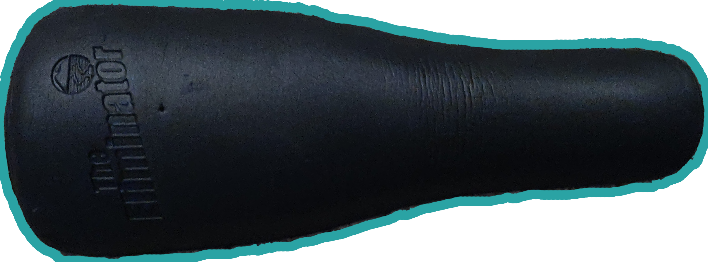
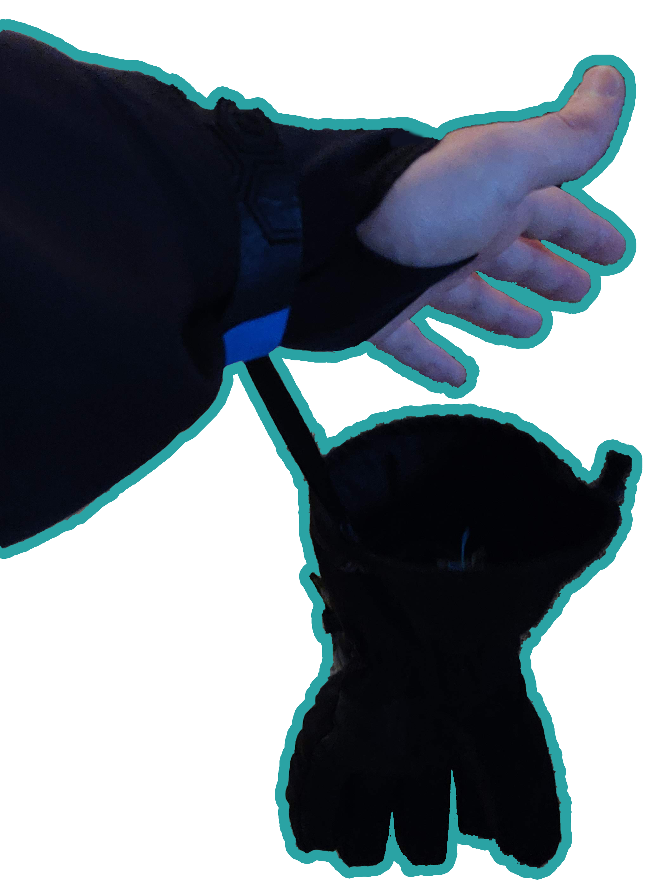
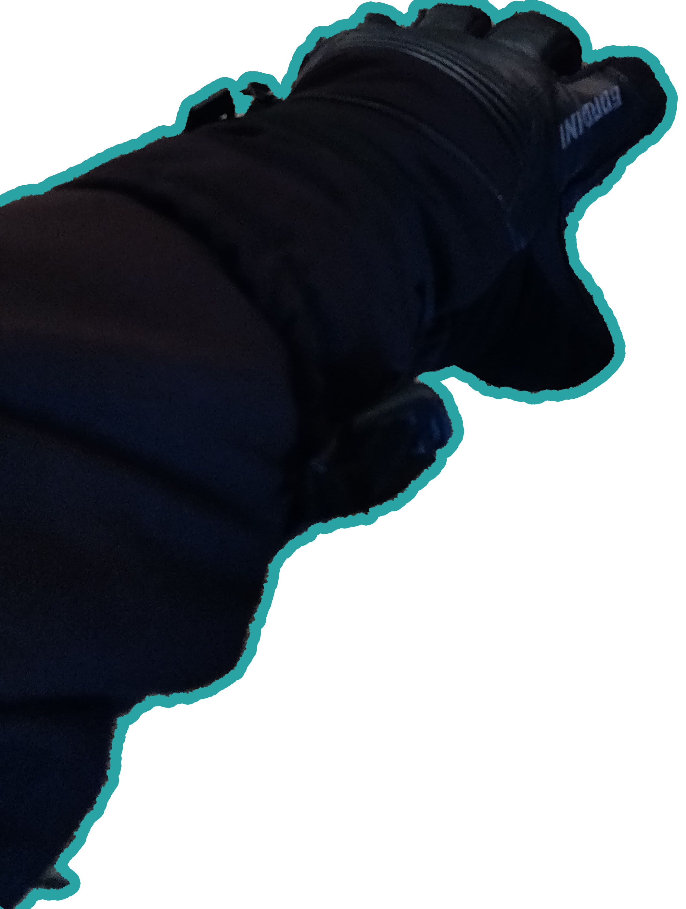
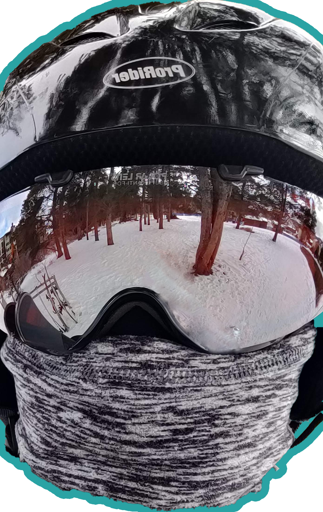

# Clothes
```Note: These clothing suggestions kept me warm at 17 degrees F and heavy winds. Adjust according to your temperatures and wind.```  
There are three important things when wearing ski clothes. Warmth, wind breaking, and water resistance.  
1. Warmth
    * It's going to be cold. Wear multiple layers.
2. Wind Breaking
    * The wind on the slopes can be very strong, especially when riding lifts.
3. Water Resistance
    * If it is snowing, or if you fall, you will get snow on you. This snow will melt and you will get wet, which is a bad idea when it's cold.

## Upper Body
___Long Johns -> Turtleneck -> Sweater -> Ski Jacket___
* Ski Jackets can be replaced by a wind breaker in a pinch. However, you will lose many of their useful features.
    1. Extra warmth.
    2. Large interior and exterior water resistant pockets with large zippers that can be opened with gloves.
    3. Waist enclosure that prevents snow from coming up under your jacket when you fall.
    4. Wrist velcro to prevent snow from getting under your jacket.

## Lower Body
___Long Johns -> Ski/Snowboarding Pants___
* Ski/Snowboarding Pants will be water resistant, wind breaking, and warm.

## Feet
___Foam Shin Pad(Optional) -> Long, Thick Socks___
* Socks should be long enough to rise above your boots.
* Shin pad will help protect your shin when you lean your body weight against the front of your boots.
* Shin pads go under socks and long johns with the socks and long johns meeting above the boot line.
* You can buy toe warmers which will stick to the bottom of your socks.

| Shin Guard | Feet Setup |
| --- | --- |
|  |  |

## Hands
___Ski Jacket Thumb Hole -> Ski Glove Strap -> Ski Jacket Velcro Strap -> Warm Insert Glove(Optional) -> Ski Glove___  
| Gloves Off | Gloves On |
| --- | --- |
|  |  |


* This layering setup allows for a completely sealed wrist and allows for you to take off your glove without danger of losing it.
* You can buy hand warmers which will go into a slot in your gloves. Do not place warmers against your skin.

## Head
___Earbud(Only One) -> Face Mask/Balaclava -> Tall Turtle Neck -> Helmet -> Goggles___
| Head Setup |
| --- |
|  |
* Turtle neck should go over face mask and back of head.

[`Top`](#clothes)  
[`Return`](./README.md#floridian-guide-to-skiing)