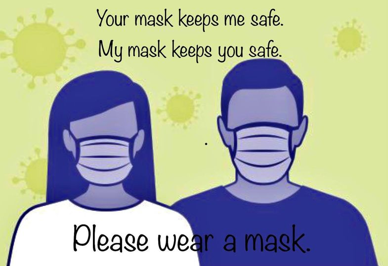

# Covid-19
There are several precautions you should take to help slow the spread of the Sars-Cov-2 virus.
1. Make sure you are always wearing your mask over both your mouth and nose at all times when on the slope.
2. If you are using a mask with nose openings, mouth opening, and/or mouth perforations, make sure you are covering it with another article. In the [`Clothes`](./Clothes.md#Head) section, wearing a long turtle neck over your mask is recommended.
3. When getting on a lift, try to only ride with those you are housing with.
   * If adding another group or a singles rider, make sure there is at least one empty seat between them and your group.
   * If you are a singles rider, or joining another group, ask them to make sure they are comfortable riding with others.
     * Some groups may only be comfortable riding with others if they are at least two seats away.
4. If available, download the Covid tracker app for the state you are skiing in. It is 100% anonymous and will alert you and, if you choose, the state, if you have recently been near someone who has tested positive for Sars-Cov-2.
   * Here is a great article explaining how the trackers work and how they are 100% anonymous. [`Contact Tracing`](https://ncase.me/contact-tracing/)
5. Physically distance with other skiers as much as possible.

[`Image Source`](https://www.nm.org/-/media/northwestern/resources/care-areas/infectious-disease/how-to-wear-face-mask.pdf)