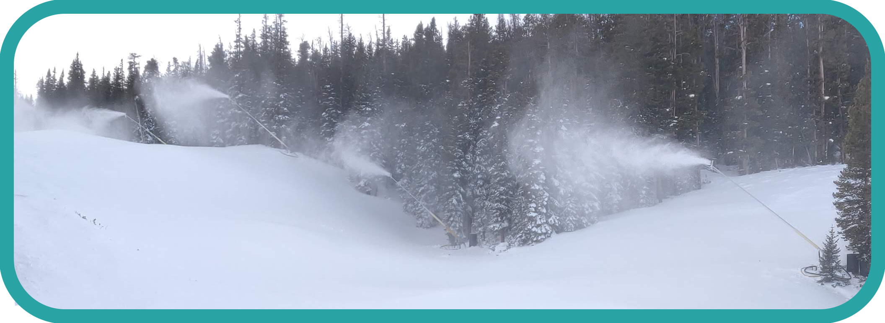
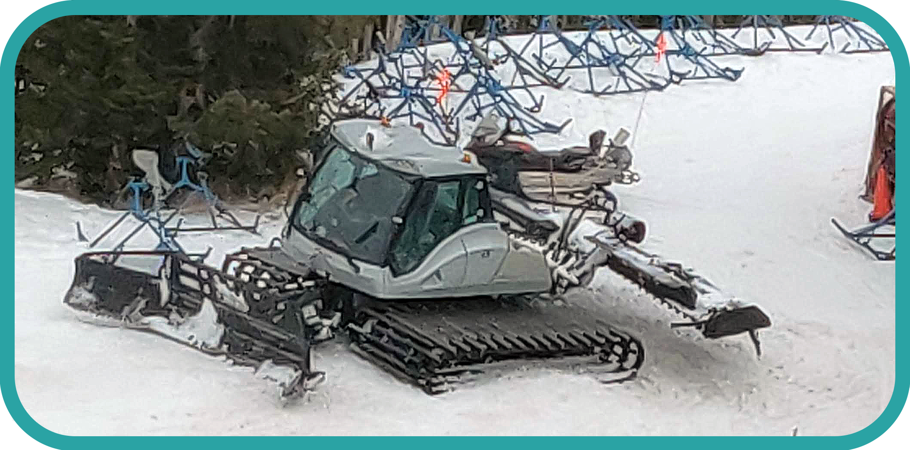

# Conditions
## Snow Types
### Powder
* This snow is left behind after snowfall.
* A light layers is preferable because it leads to smooth skiing.
### Ice
* This snow occurs after snow has been exposed to the sun for a while without new snow to cover it. This is because the sun melts the snow into water which is then refrozen into ice. [`Citation`](https://answers.yahoo.com/question/index?qid=20090131102520AAHFqrW) 
* Will cause skidding and sliding and hurts the most to fall on making it the most dangerous.
* Sharp edges on skis can help reduce skidding.
### Packed Snow
* Powder after being skied on for a while without new snow, compacting it. 
* Can cause skidding.
* Sharp edges on skis can help reduce skidding.
### Heavy Powder
* When there is heavy snowing, causing snow to pile up.
* This snow makes it had to turn and slows you down.
### The 50000000 Other Types Of Snow

## Misc.
### Snow Guns
* Snow can be added to slopes that don't have enough for skiing by blasting them with snow guns.
* The guns blast out pressurized water and air, causing the water to turn to snow when it hits the cold environment.

| Snow Guns |
| --- |
|  |

### Snow Cat Groomers
* At night, snow cat groomers traverse slopes, turning packed or icy snow into powder, and leaving behind nice rake lines.
* A list of recently groomed slopes should be available.

| Snow Cat Groomer |
| --- |
|  |

[`Top`](#conditions)  
[`Return`](../README.md#floridian-guide-to-skiing)