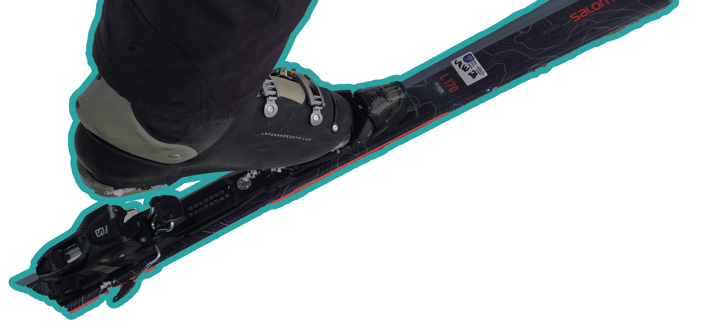
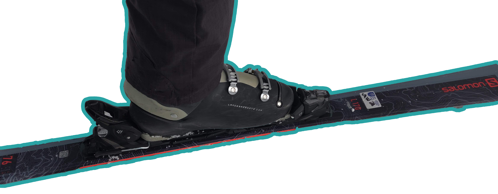
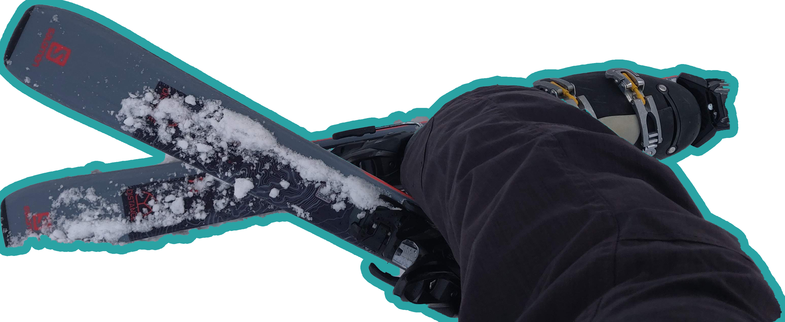
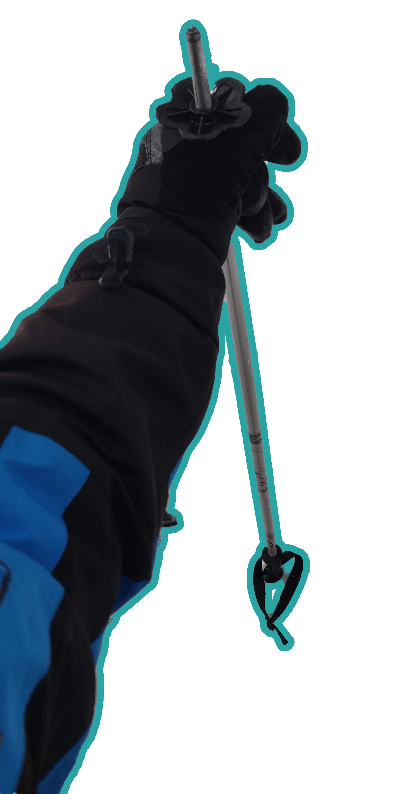
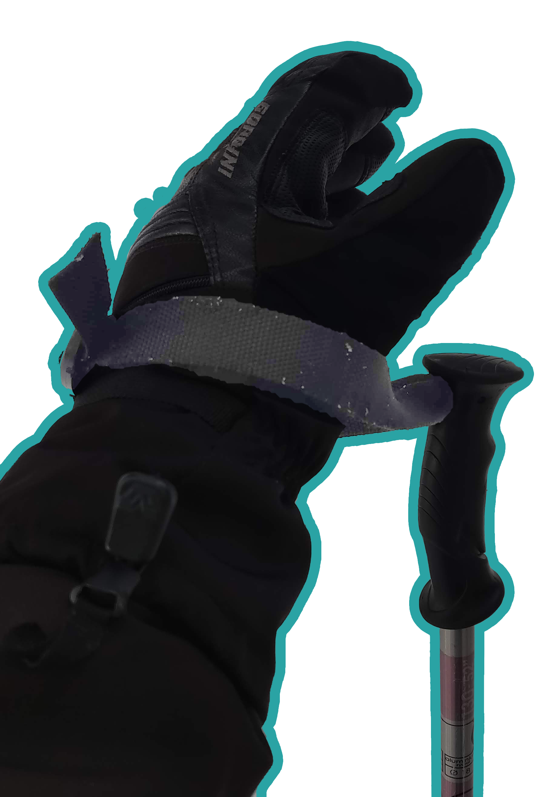
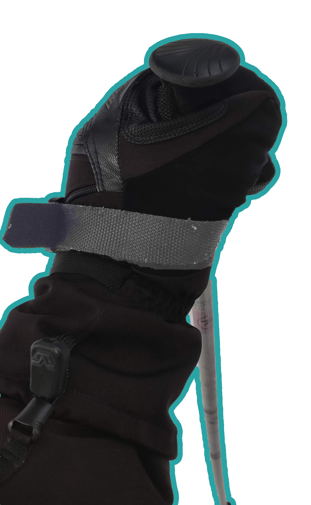

# Equipment
## Skis
1. The length should be between your shoulder and eye level when stood upright.
2. There are three ski levels signifying how much force is needed to release the boots from the skis.
    * Beginners should take level 1 because if they fall they want their skis to come off.
    * Experts should take level 3 because when they are going fast, taking tight turns, or skiing moguls, the don't want the ski to randomly pop off.
3. Ski edges should be sharpened metal to catch the snow.
4. Ski bottoms should be waxed to slide on the snow.

| Ski Height |
| --- |
|  |

### How To Put On
1. Make sure the latch at the back is in the downward position.
    * Use your boot too do this.
2. Place the front of your boot into the forward latch.
3. Firmly put weight on the back of your boot while lining it up with the back latch.
4. The back latch should click into the upward position.

| Front In | Back In |
| --- | --- |
|  |  |

### How To Take Off
1. Lift the bottom of one ski and place the back of it over the back latch of the other ski.
2. Press down to release the latch.
3. Use your freed boot to press down on the other ski's back latch.

| Unclasp |
| --- |
|  |

## Boots
1. Boots should be very snug and tight.
2. There should be little wiggle room from side to side.
    * The more wiggle room there is the less control you will have over your skis.
3. Make them as tight as possible.

## Poles
1. Hold the pole upside down and under the snow basket. With the handle touching the ground, your forearm should be level.

| Hold Pole |
| --- |
|  |

### Wearing Poles
1. Move your glove through the bottom of the strap.
2. With the strap around the back of your wrist and your hand above and behind the pole, move your hand down and grip the pole.
3. With this configuration, you can put weight down on the pole, without having to grip the pole hard or even at all.

| Strap | Grasp |
| --- | --- |
|  |  |

[`Top`](#equipment)  
[`Return`](../README.md#floridian-guide-to-skiing)