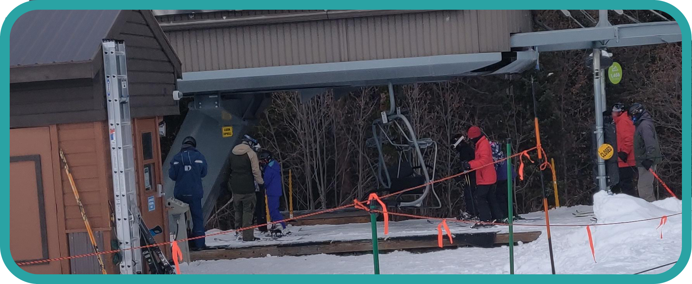
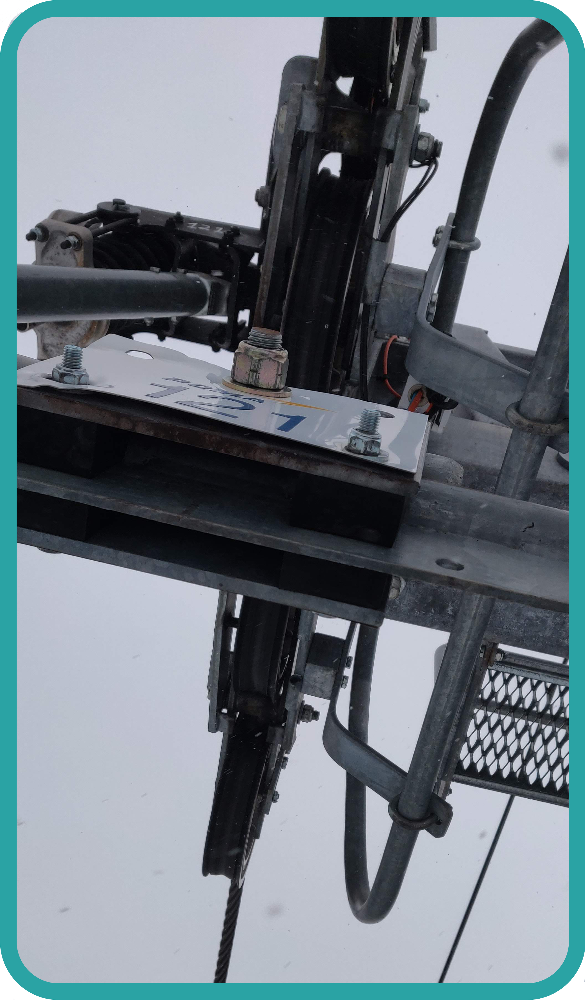

# Lifts
## Line Etiquette
* Always alternate and allow those in the singles line into your group unless otherwise directed by a lift attendant.
## Embarking
* Remove pole straps.
* Remove backpacks and hold them.
* When the lift for the group in front of you has swung out, move forward until your boots are on the stop sign on the ground.
* Look behind you and sit as the lift reaches your legs. 
* Make sure everyone is ready before lowering the bar.
## Disembarking
* Make sure to coordinate who is going in which direction when leaving the lift.
* Raise the bar at least one support column before the end. 
* Raise your ski tips, and stand up once your skis are solidly on the ground. The lift will push you forward.
## Chairs
* Older 2 person lifts.
* These lifts do not slow down at the base or top so the lift attendant will swing it back to make it slower when you sit on it. However, this will cause it to accelerate rapidly so make sure you are securely sitting quickly.
## Super Chairs
* Newer 4-6 person lifts.
* These lifts slow down at the base and top by moving the lift off the main line to a slower, secondary line.
* They usually have foot rests attached to the bar.

| Super Chair |
| --- |
|  |

## T-Bar
* T-Bars allow for 2 people to ski uphill being pulled by one part of the upside down T that they sit on.
* They are the slowest lifts by far.
* T-Bars are used at the top of mountains, usually to access double black diamond bowls. This is because it is hard to build lifts that high up on the mountain and T-Bars are smaller and more resilient.
## Platter Lifts
* Platter lifts allow for one person to ski uphill being pulled by a plater at the bottom of a pole that they sit on.
* They have a similar speed to T-Bars.
* Platter lifts are used mainly in beginner zones where they move you up a small distance to practice skiing.

## Lucky Lift Stop
* If your lift stops on a support column you can make a wish. Make sure not to let anyone know what it is!

| Lucky Lift |
| --- |
|  |

[`Top`](#lifts)  
[`Return`](../README.md#floridian-guide-to-skiing)