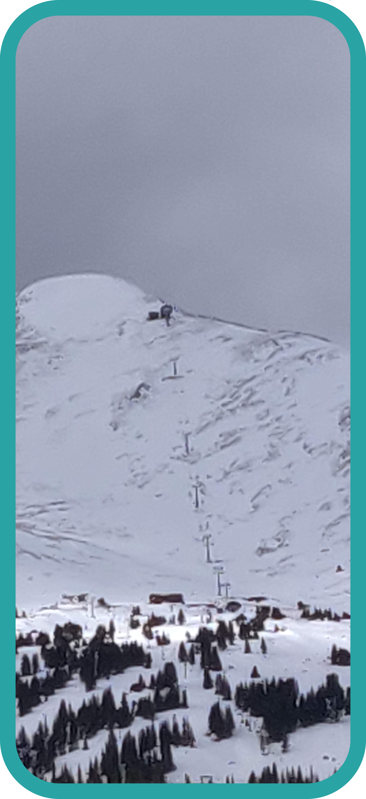

# Slopes
There are five categories of slopes(in North America and Canada).
## Green(Circle)

* These are beginner slopes which are usually flat with inclines between `0 and 14` degrees.
## Blue(Square)

* These are intermediate slopes with inclines between `14 and 22` degrees.
## Black Diamond

* These are advanced slopes with inclines over `22` degrees.
## Double Black Diamond

* These are very advanced slopes with inclines over `26` degrees.
## Extreme(Double Black Diamond With EX In Them)
* These are extreme slopes with large exposed rocks and drops.

## Extra Classifications
### Moguls
* Can be on slopes blue and above. Are mounds of snow that are difficult to traverse.

| Moguls |
| --- |
|  |
### Shoots
* Think natural half pikes with moguls.
### Bowls
* Wide open expanses of snow. Usually at the top of mountains and are mostly double black diamonds and extreme slopes.

| Bowl |
| --- |
|  |
### Terrain Parks
* Half pikes, jumps, metal bars to slide on, etc.

[`Top`](#slopes)  
[`Return`](../README.md#floridian-guide-to-skiing)